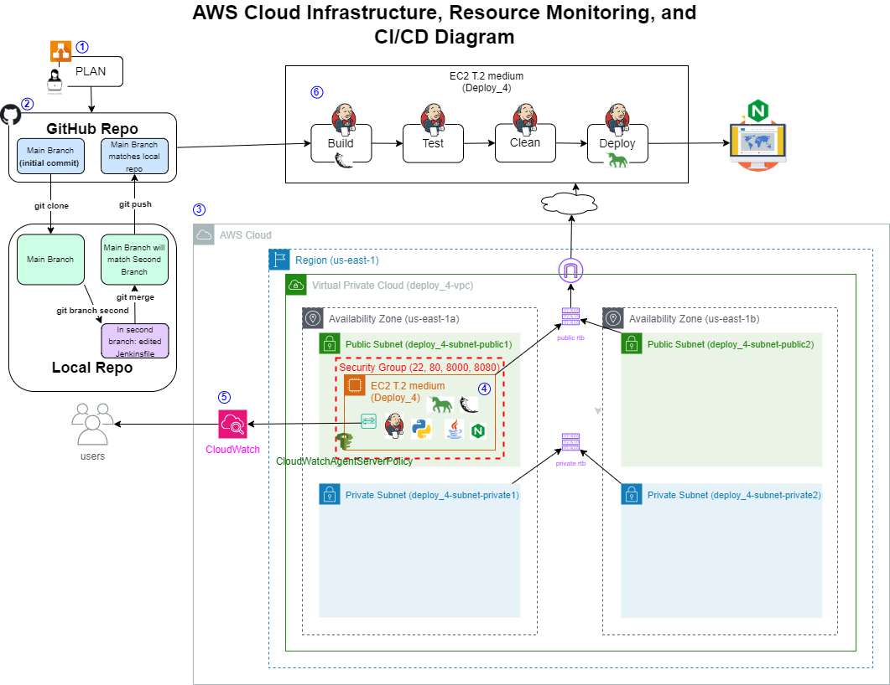
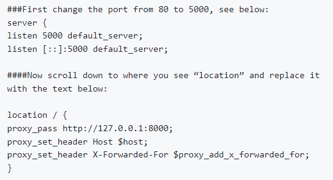
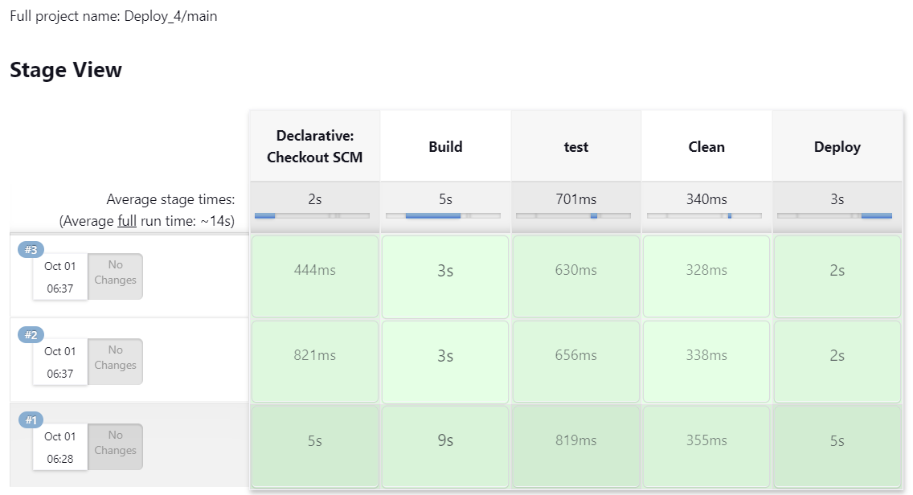
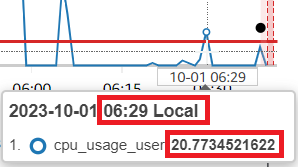
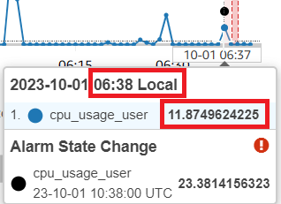
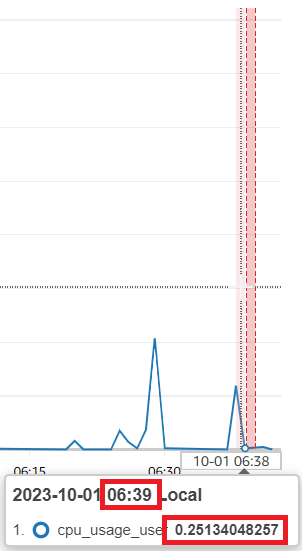
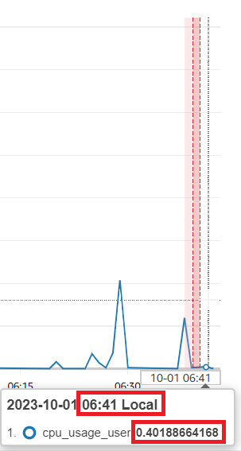
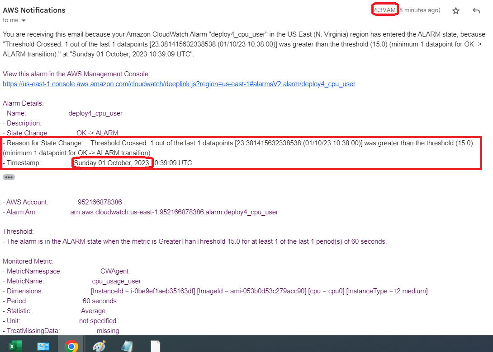
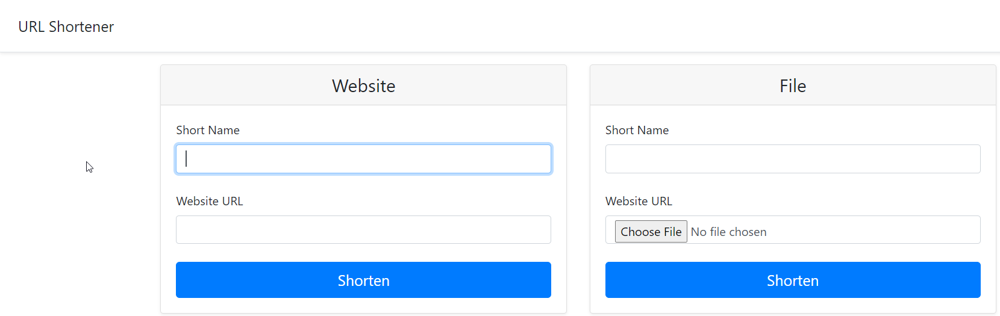
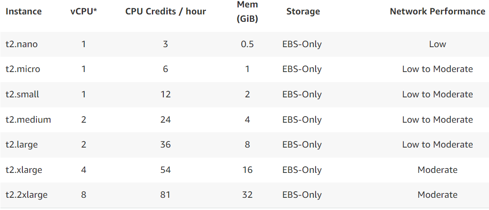

# Monitor Applications and Server Resources

October 1, 2023

By:  Annie V Lam - Kura Labs

# Purpose

Monitor application and server resources using AWS CloudWatch.

Previously, our CI/CD pipeline was automated using Jenkins and leverages GitHub webhooks for seamless integration. In this deployment, a Virtual Private Cloud (VPC), availability zones, and subnets are configured to create a secure and scalable network architecture.  We also integrated CloudWatch agents with our EC2 instances to allow us to collect valuable performance metrics and logs.  Also, instead of using the Elastic Beanstalk CLI for web application deployment, we've opted for GUnicorn, which provides a robust HTTP server and deployed to Nginx, which serves efficient and reliable web content.

## Step #1 Diagram the VPC Infrastructure and the CI/CD Pipeline

## Step #2 GitHub/Git

GitHub serves as the repository from which Jenkins retrieves files to build, test, and deploy the URL Shortener application.  For this deployment, after the initial commit, the GitHub repository was cloned locally. Then a new branch was created, and the Jenkinsfile was edited with the necessary changes. The changes were committed and the second branch was subsequently merged into the main branch. Finally, the updated main branch was pushed to the GitHub repository.

In order for the EC2 instance, where Jenkins is installed, to access the repository, you need to generate a token from GitHub and then provide it to the EC2 instance.

[Generate GitHub Token](https://github.com/LamAnnieV/GitHub/blob/main/Generate_GitHub_Token.md)

## Step #3 Setup VPC and EC2 Infrastructure 

**Instructions to Setup the infrastructure for two private subnets and two public subnets**

[Setup VPC](https://github.com/LamAnnieV/Setup_VPC/blob/main/1_Setup_VPC.md)

[Setup Subnets](https://github.com/LamAnnieV/Setup_VPC/blob/main/2_Setup_Subnets.md)

[Setup Route Tables](https://github.com/LamAnnieV/Setup_VPC/blob/main/3_Setup_Route_Tables.md)

[Setup Internet Gateways](https://github.com/LamAnnieV/Setup_VPC/blob/main/4_Setup_Internet_Gateways.md)

**Instructions to Setup a New EC2 Instance**

[Create EC2 Instance](https://github.com/LamAnnieV/Create_EC2_Instance/blob/main/Create_EC2_Instance.md)

## Step #4 Installs for EC2 

**Shell Scripts for Python and other installs**

Python is used in the application and the test stage

[Install "python3.10-venv", "python3-pip" and "zip"](https://github.com/LamAnnieV/Instance_Installs/blob/main/02_other_installs.sh)

**Shell Scripts to Install Nginx**

Nginx is used as a web server for hosting the URL Shortener application

[Install Nginx](https://github.com/LamAnnieV/Instance_Installs/blob/main/Install_Ngnix.sh)

After Nginx was installed, edit the configuration file "/etc/nginx/sites-enabled/default" with the information below:

**Jenkins**

Jenkins is used to automate the Build, Test, and Deploy the URL Shortener Application.  To use Jenkins in a new EC2, all the proper installs to use Jenkins and to read the programming language that the application is written in need to be installed. In this case, they are Jenkins, Java, and Jenkins additional plugin "Pipeline Keep Running Step".

**Instructions for Jenkins Install and other Installs required for Jenkins**

[Install Jenkins](https://github.com/LamAnnieV/Instance_Installs/blob/main/01_jenkins_installs.sh)

[Install "Pipeline Keep Running Step" Plugin](https://github.com/LamAnnieV/Jenkins/blob/main/Install_Pipeline_Keep_Running_Step.md)

## Step #5 Configure CloudWatch and Create Alarms to Monitor Resources

CloudWatch is used to monitor our resource usage in our instance.

[Install/Configure CloudWatch](https://docs.aws.amazon.com/AmazonCloudWatch/latest/monitoring/install-CloudWatch-Agent-on-EC2-Instance-fleet.html)

Alarms allow you to set thresholds in CloudWatch, which will notify you when those thresholds are breached.

[How to create a CloudWatch alarm](https://docs.aws.amazon.com/AmazonCloudWatch/latest/monitoring/ConsoleAlarms.html)

## Step #6 Configure GitHub Webhook

When a commit is made in GitHub, the 'Run Build' process still needs to be manually initiated. To automate this workflow, we configured a GitHub Webhook. Now, whenever there is a commit in the GitHub Repository, the webhook automatically triggers Jenkins to push the files and initiate the Build process.

[Configure GitHub Webhook](https://github.com/LamAnnieV/GitHub/blob/main/Configure_GitHub_Webhook.md)

## Step #7 Configure Jenkins Build and Run Build

[Create Jenkins Multibranch Pipeline Build](https://github.com/LamAnnieV/Jenkins/blob/main/Jenkins_Multibranch_Pipeline_Build.md)

Jenkins Build:  In Jenkins create a build "Deployment_4" for the URL Shortener application from GitHub Repository https://github.com/LamAnnieV/deployment_4.git and run the build.  This build consists of four stages:  The Build, the Test, the Clean, and the Deploy stages.

### Results
**The build was successful, see build run #1 - 3**

**CloudWatch Monitoring for Build #1**

#### CloudWatch Monitoring for Build #2 and 3 that was run back to back

**Build #2 Resource Usage**

**Build #3 Resource Usage at the beginning of the build**

**Build #3 Resource Usage towards the end of the build**

**CloudWatch Notification that Resource Usage is over 15%**

**Launch URL Shortener Website**

### Conclusion

AWS offers various instance types with different resource capacities. If we base our instance type selection solely on running one build at a time, our current choice, the T2 Medium, seems a bit excessive, as we utilize only about 21% of the CPU capacity.

However, when we consider running builds consecutively, the CPU usage increases to 40%. If we were to use the T2 Micro instance type, which has one CPU, instead of the T2 Medium with two CPUs, our usage percentage would double to 80%. Operating at 80% capacity could potentially hinder performance or even lead to system crashes.

**AWS Instance Type Capacity**

## Issue(s): 

- Our initial build did not trigger an email notification, despite the CPU usage exceeding the set threshold of 15%. This issue may be related to the CloudWatch configuration, which typically takes a couple of minutes to become active after setup completion. In the future, we will conduct notification tests before relying on them in production.  
  
## Area(s) for Optimization:

-  Automate the AWS Cloud Infrastructure using Terraform

Note:  ChatGPT was used to enhance the quality and clarity of this documentation
  
