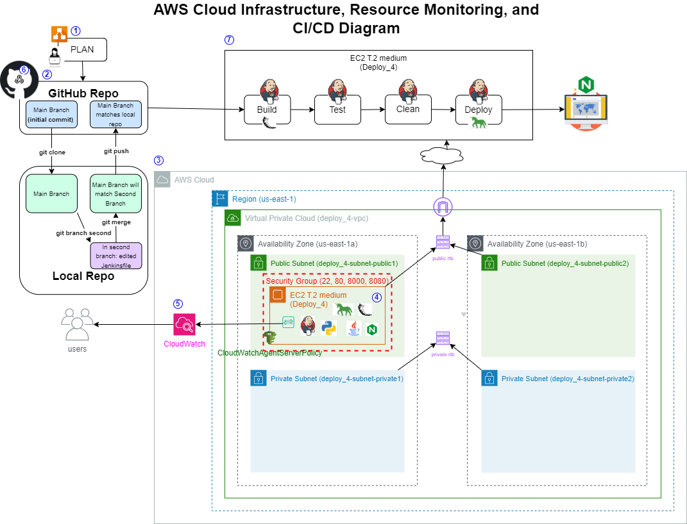

# Monitor Applications and Server Resources

October 1, 2023

By:  Annie V Lam - Kura Labs

# Purpose

Monitor application and server resources using AWS Cloudwatch.

Previously, the CI/CD pipeline was automated using Jenkins and GitHub webhook.  For this deployment, Cloudwatch was integrated with the EC2 where it can monitor the EC2 resources via Cloudwatch agents. Instead of using Elastic Beanstalk CLI to deploy the application, GUnicorn used and deployed to the Nginx web server

## Step #1 Map Out the Deployment

## Step #2 Download Repository to GitHub

GitHub is the repository where Jenkins retrieves the files to build, test, and deploy the URL Shortener application.  In order for the EC2, where Jenkins is installed, to get access to the repository a token needs to be generated from the GitHub and passed to the EC2.

[Generate GitHub Token](https://github.com/LamAnnieV/GitHub/blob/main/Generate_GitHub_Token.md)

## Step #3 Setup EC2 Instance and Install Jenkins

**Jenkins**
Jenkins is used to automate the Build, Test, and Deploy the URL Shortener Application.  To use Jenkins in a new EC2, all the proper installs to use Jenkins and to read the programing language that the application is written in need to be installed. In this case, they are Jenkins, Java, Python, and Jenkins additional plugin "Pipeline Utility Steps".

**Instructions to Setup a New EC2 Instance**

[Create EC2 Instance](https://github.com/LamAnnieV/Create_EC2_Instance/blob/main/Create_EC2_Instance.md)

[Create IAM Roles for Elastic Beanstalk and EC2](https://github.com/LamAnnieV/Setup_AWS/blob/main/Create_AWS_IAM_Roles.md)

**Shell Scripts for Install(s) in the Instance**

[Install "python3.10-venv", "python-pip", "python3-pip" and "unzip"](https://github.com/LamAnnieV/Instance_Installs/blob/main/02_other_installs.sh)

**Instructions for Jenkins Install, Install Plugin(s), and Create Build**

[Jenkins Install](https://github.com/LamAnnieV/Instance_Installs/blob/main/01_jenkins_installs.sh)

[Install "Pipeline Utility Step" Plugin](https://github.com/LamAnnieV/Jenkins/blob/main/Install_Pipeline_Utility_Step_Plugin.md)

[Create Jenkins Multibranch Pipeline Build](https://github.com/LamAnnieV/Jenkins/blob/main/Jenkins_Multibranch_Pipeline_Build.md)

### Jenkins Build #1:  In Jenkins create a build "Deployment_03" for the URL Shortener application from GitHub Repository https://github.com/LamAnnieV/Deployment_03 and run the build.  This build consists of two stages:  The build Stage and the Test Stage

**Result:  Build and Test was successful, see run #1**

## Step #4 Install AWS ELastic Beanstalk CLI

In Deployment #2, the URL Shortener was manually deployed via AWS Elastic Beanstalk.  In this deployment, AWS CLI and AWS EB CLI were installed to automate the deployment of the URL Shortener.

**AWS EB CLI Install**

[Generate AWS CLI Credentials](https://github.com/LamAnnieV/Setup_AWS/blob/main/Generate_AWS_CLI_Credentials.md)

[Script to Install CLI](https://github.com/LamAnnieV/Instance_Installs/blob/ec378d89c22c95a909cb1283516e633ab6c9b153/03_CLI_installs.sh)

[Script to Install AWS EB CLI Part I](https://github.com/LamAnnieV/Instance_Installs/blob/main/04A_AWS_EB_CLI_install.sh)

[Script to Install AWS EB CLI Part II](https://github.com/LamAnnieV/Instance_Installs/blob/main/04B_AWS_EB_CLI_install.sh)

[Script to Install AWS EB CLI Part II](https://github.com/LamAnnieV/Instance_Installs/blob/main/04C_AWS_EB_CLI_install.sh)

**After installing the AWS EB CLI the application URL was displayed:**

### Jenkins Build #2:  The Jenkins file was edited to include a "Deploy" stage, which deploys the URL shortener.

**Result:  Build and Test was successful, see run #3**

**Check EBS Health**

**Launch URL Shortener Website**

## Step #4 Configure GitHub Webhook

When there is a commit in GitHub, the "Run Build" still needs to be manually ran.  To automate this process, a GitHub Webhook was configured.  When there is a commit in the GitHub Repository, The webhook pushes the files to Jenkins and automatically runs the Build.

**To configure GitHub Webhook**

[Configure GitHub Webhook](https://github.com/LamAnnieV/GitHub/blob/main/Configure_GitHub_Webhook.md)

**Webhook Validated**

### Jenkins Build #3: Webhook was configured in GitHub and the base.html file was edited to test the Webhook, which should auto "Run Build" in Jenkins

In Jenkins Build #1 and #2, when there is a commit in GitHub, the "Run Build" still needs to be manually ran.  To automate this process, a GitHub Webhook was configured.  When there is a commit in the GitHub Repository, the webhook pushes the files to Jenkins and automatically runs the Build.

To test the webhook, the file https://github.com/LamAnnieV/Deployment_03/blob/main/templates/base.html was edited to change "URL Shortener" to "URL Shrinker"

### Result:  Build and Test was successful, see run #4

### Launch URL Shortener Website

## Issue(s): 

- There was an issue installing the ADW EB CLI.  In this case in order to successfully install ADW EB CLI, Python3-pip needed to be installed beforehand.
            
## Area(s) for Optimization:

- Further automate the installs to minimize manual input/entries
- Install and configure Monitoring for Systems and Application Files
  
