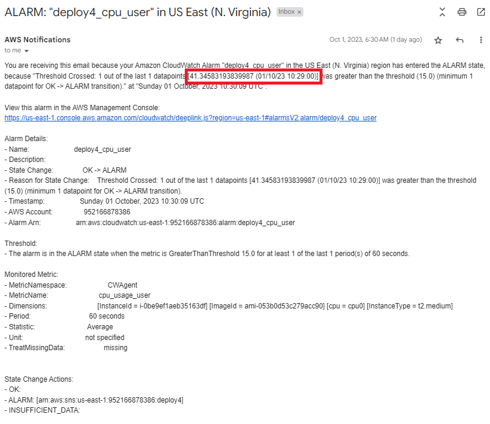

# Monitor Applications and Server Resources

October 1, 2023

By:  Annie V Lam - Kura Labs

# Purpose

Monitor application and server resources using AWS CloudWatch.

Previously, the CI/CD pipeline was automated using Jenkins and GitHub webhook.  For this deployment, the Virtual Private Cloud, availability zone, and subnets were configured. CloudWatch was integrated with the EC2 where it can monitor the EC2 resources via CloudWatch agents. Instead of using Elastic Beanstalk CLI to deploy the application, GUnicorn was used and deployed to the Nginx web server

## Step #1 Diagram the VPC Infrastructure and the CI/CD Pipeline

[Deployment Diagram](Images/Deployment_Pipeline.png)

## Step #2 GitHub/Git

GitHub is the repository where Jenkins retrieves the files to build, test, and deploy the URL Shortener application.  For this deployment, after the initial commit, the GitHub was cloned into the local report, where it was branched and the Jenkinsfile was edited and the changes were commited.  The second branch was then merged to the main branched, then pushed to the GitHub repository.

## Step #3 Setup VPC and EC2 Infrastructure 

**Instructions to Setup the infrastructure for two private subnets and two public subnets**

[Setup VPC](https://github.com/LamAnnieV/Setup_VPC/blob/main/1_Setup_VPC.md)

[Setup Subnets](https://github.com/LamAnnieV/Setup_VPC/blob/main/2_Setup_Subnets.md)

[Setup Route Tables](https://github.com/LamAnnieV/Setup_VPC/blob/main/3_Setup_Route_Tables.md)

[Setup Internet Gateways](https://github.com/LamAnnieV/Setup_VPC/blob/main/4_Setup_Internet_Gateways.md)

**Instructions to Setup a New EC2 Instance**

[Create EC2 Instance](https://github.com/LamAnnieV/Create_EC2_Instance/blob/main/Create_EC2_Instance.md)

## Step #4 Installs for EC2 

**Shell Scripts for Python and other installs**

The Web application is written in Python

[Install "python3.10-venv", "python3-pip" and "zip"](https://github.com/LamAnnieV/Instance_Installs/blob/main/02_other_installs.sh)

**Shell Scripts to Install Nginx**

Nginx is for ???

[Install Nginx](https://github.com/LamAnnieV/Instance_Installs/blob/main/Install_Ngnix.sh)

**Jenkins**

Jenkins is used to automate the Build, Test, and Deploy the URL Shortener Application.  To use Jenkins in a new EC2, all the proper installs to use Jenkins and to read the programming language that the application is written in need to be installed. In this case, they are Jenkins, Java, and Jenkins additional plugin "Pipeline Keep Running Step".

**Instructions for Jenkins Install and other Installs required for Jenkins**

[Install Jenkins](https://github.com/LamAnnieV/Instance_Installs/blob/main/01_jenkins_installs.sh)

[Install "Pipeline Keep Running Step" Plugin](https://github.com/LamAnnieV/Jenkins/blob/main/Install_Pipeline_Keep_Running_Step.md)

## Step #5 Configure CloudWatch and Create Alarms to Monitor Resources

[Install/Configure CloudWatch](https://docs.aws.amazon.com/AmazonCloudWatch/latest/monitoring/install-CloudWatch-Agent-on-EC2-Instance-fleet.html)

[How to create a CloudWatch alarm](https://docs.aws.amazon.com/AmazonCloudWatch/latest/monitoring/ConsoleAlarms.html)

## Step #6 Configure Jenkins Build and Run Build

[Create Jenkins Multibranch Pipeline Build](https://github.com/LamAnnieV/Jenkins/blob/main/Jenkins_Multibranch_Pipeline_Build.md)

### Jenkins Build:  In Jenkins create a build "Deployment_4" for the URL Shortener application from GitHub Repository [https://github.com/LamAnnieV/deployment_4.git] and run the build.  This build consists of four stages:  The build, the Test, the Clean, and the Deploy stages.

**Jenkins Result:  The build was successful, see run #1 - 3**

**CloudWatch Monitoring for Build #1**

**CloudWatch Monitoring for Build #2 and 3 that was run back to back**

Build #2 Resource Usage

Build #3 Resource Usage at the beginning of the build

Build #3 Resource Usage towards the end of the build

CloudWatch Notification that Resource Usage is over 15%

**Launch URL Shortener Website**

**Conclusion**

We used T.2 medium for this EC2 instance and this build uses a log

## Issue(s): 

- This deployment went pretty smoothly, but there might be issues if we run too many builds at once or if there are too much traffic in the URL Shortener.
  
## Area(s) for Optimization:

- 1.  
  
